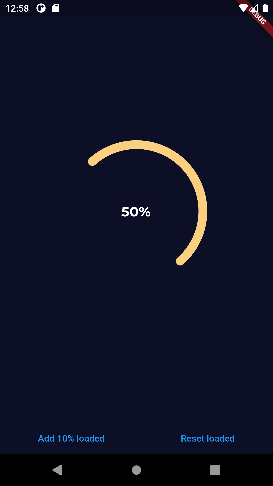

Activate Health Loader Hometask

# Screenshots

|   |   |   |
| - | - | - |
|   |  |  |
|   |   |   |

# General info

- Words *loader* and *progress indicator* are used interchangeably, sorry about that.
- Use bottom buttons to play around with the widget.
- Read `loader.dart` for more info on progress indicator component.
- For complicated animations, `flutter_sequence_animations` package was used.
- SpinningArcs animation code is a bit messy.
- Left the `archive.dart` file with commented out code for personal purposes.

# Time spent

Overall one and a half days. 9 hours and 5 hours. 14 hours total.
